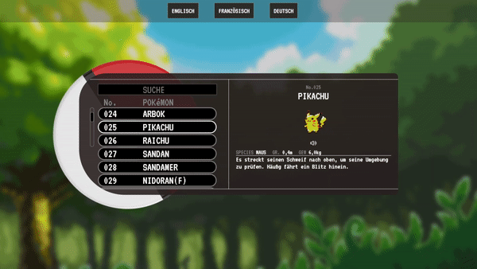
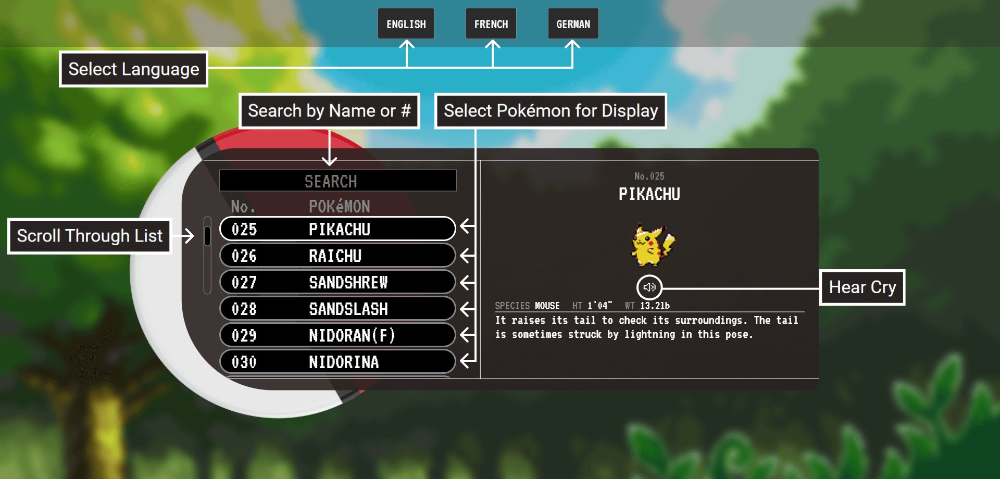
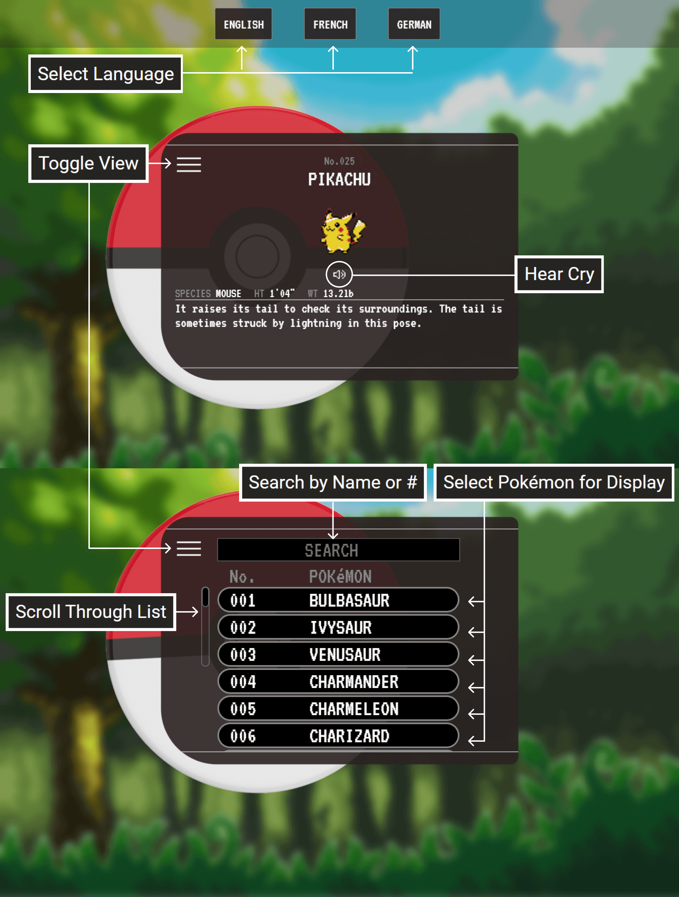

# PokéLex

PokéLex ("Pokédex" + "lexicon") is a website that combines an immersive language learning approach with the universally-loved, multimedia sensation that is Pokémon. Practice your foreign language skills by learning about the world's favorite mythical creatures via this interactive, multilingual encyclopedia!

[Try it out here!](https://www.pokelex.com/)

## Installation

No installation is necessary! 

Simply [visit the website](https://www.pokelex.com/) or download the project and run the included index.html - it will load in your web browser.

## Usage

Built with HTML, CSS, & JavaScript (via features such as the utilization of third-party APIs & ES6's async-await and Promises), PokéLex boasts a slick interface and parallels many of the functionalities of the actual Pokédex device as featured throughout the famous video game series:

## Roadmap

Future Goals:  

•Spanish, Italian and Japanese as language options.

•Additional encyclopedia entries for each Pokémon, for more learning material.

•Additional Pokédex features, such as a map showing Pokémon locations in the world and additional search criteria.

•Interaction-triggered sprite animation.